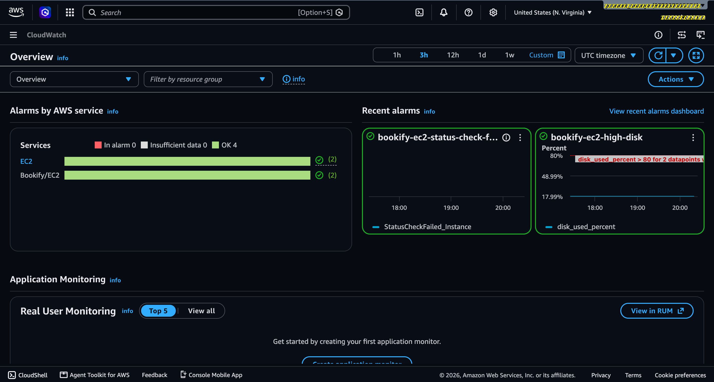
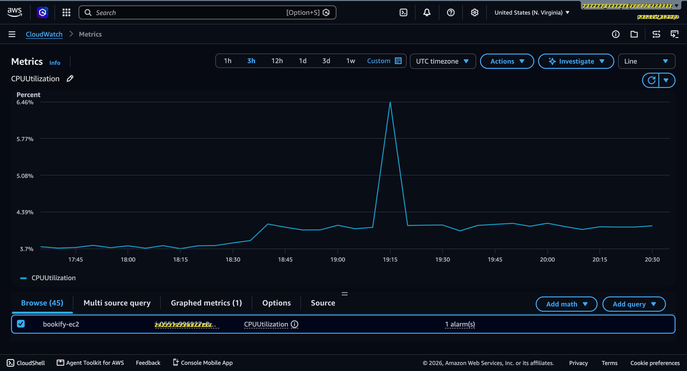
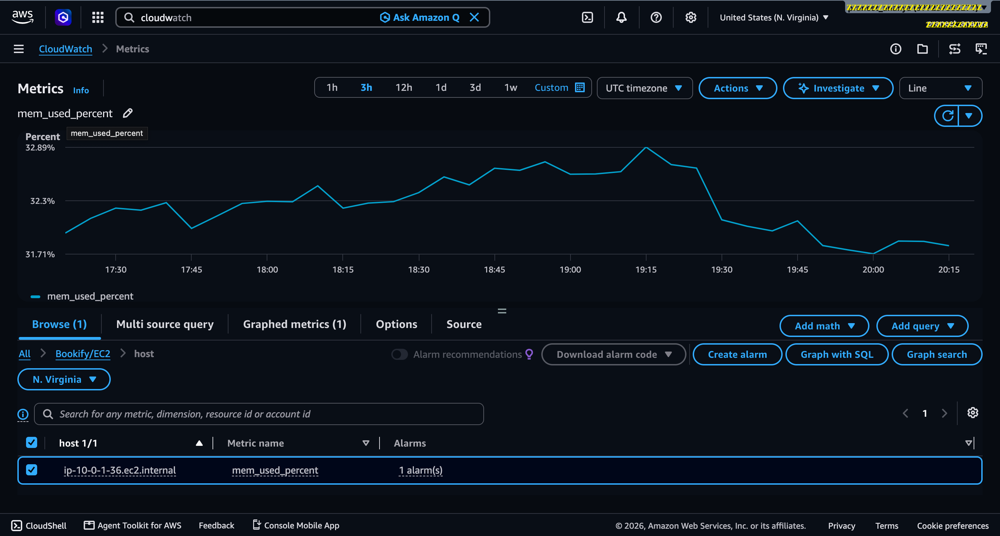
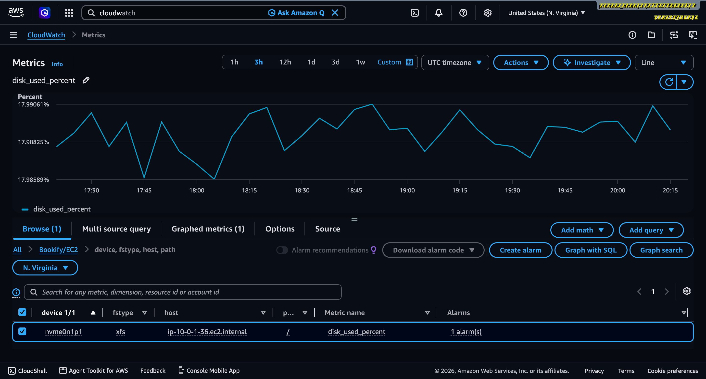
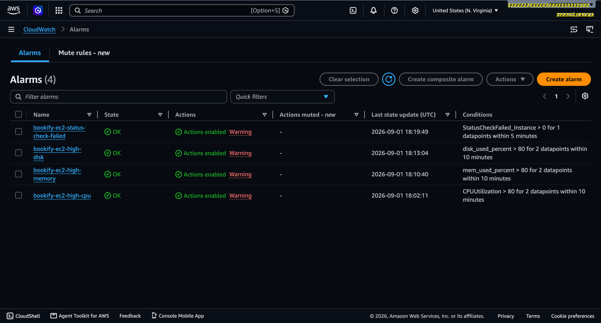
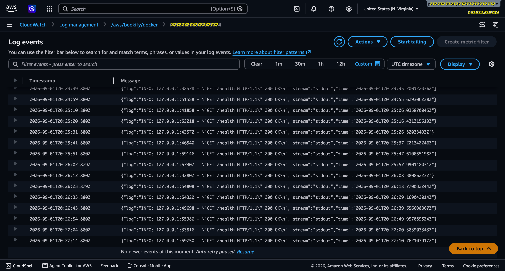

# Bookify API

[](https://github.com/ananyapraneet/bookify-api/actions/workflows/ci.yml)
[](https://github.com/ananyapraneet/bookify-api/actions/workflows/cd.yml)
[](LICENSE)

A production-style **SaaS backend for a service booking and appointment management platform**, built with FastAPI and PostgreSQL.

The project was developed incrementally with a focus on:

* Backend architecture
* REST API design
* Authentication and authorization
* Database architecture and migrations
* Business logic and validation
* Redis caching
* Background processing with Celery
* Automated testing
* Docker containerization
* Infrastructure as Code with Terraform
* AWS deployment
* CI/CD with GitHub Actions
* Nginx reverse proxy
* CloudWatch monitoring and centralized logging
* Production security practices

The project is complete for the current **portfolio and production-style engineering scope**.

---

# Live API

The Bookify API is deployed on AWS EC2 and can be accessed through the public production endpoint.

**Swagger UI:** http://75.101.214.88/docs

The Swagger UI provides interactive documentation for the deployed API and allows API endpoints to be explored directly.

Additional production endpoints:

```text
GET /health
GET /health/ready
GET /docs
GET /redoc
```
> **Note:** The production URL is currently active and working. Since the API is hosted on an AWS EC2 instance, availability may vary and the endpoint may not always be accessible.

---

# Project Status

**Status: Complete — Production Deployment & Observability Implemented**

Bookify is deployed on AWS using an ARM-based EC2 instance and is accessible through an Nginx reverse proxy.

The production environment includes:

* FastAPI application
* PostgreSQL
* Redis
* Celery worker
* Nginx
* Docker Compose
* AWS EC2
* Amazon ECR
* AWS Systems Manager Parameter Store
* IAM instance roles
* Terraform
* GitHub Actions CI/CD
* CloudWatch metrics
* CloudWatch alarms
* CloudWatch centralized logging

### Live Production Endpoints

The deployed API exposes:

```text
GET /health
GET /health/ready
GET /docs
GET /redoc
```

The `/health` endpoint verifies application availability.

The `/health/ready` endpoint verifies application readiness by checking both PostgreSQL and Redis connectivity.

---

# Production Architecture

```text
                        Internet
                            │
                            ▼
                    ┌─────────────────┐
                    │   AWS EC2       │
                    │   ARM64         │
                    │                 │
                    │  Port 80        │
                    └────────┬────────┘
                             │
                             ▼
                    ┌─────────────────┐
                    │      Nginx      │
                    │  Reverse Proxy  │
                    └────────┬────────┘
                             │
                             ▼
                    ┌─────────────────┐
                    │    FastAPI      │
                    │      API        │
                    └──────┬────┬─────┘
                           │    │
              ┌────────────┘    └────────────┐
              ▼                              ▼
       ┌─────────────────┐          ┌─────────────────┐
       │   PostgreSQL    │          │      Redis      │
       │    Database     │          │ Cache / Broker  │
       └─────────────────┘          └────────┬────────┘
                                             │
                                             ▼
                                    ┌─────────────────┐
                                    │  Celery Worker  │
                                    │ Background Jobs │
                                    └─────────────────┘

        Docker stdout/stderr
                │
                ▼
        Docker json-file logs
                │
                ▼
        CloudWatch Agent
                │
                ▼
        CloudWatch Logs
```

---

# AWS Production Environment

The application is deployed on:

* **AWS EC2**
* Amazon Linux 2023
* ARM64 architecture
* Public HTTP access through port 80
* Nginx reverse proxy
* Dockerized application stack

### AWS Services Used

| Service             | Purpose                             |
| ------------------- | ----------------------------------- |
| EC2                 | Application hosting                 |
| ECR                 | Container image registry            |
| IAM                 | Instance permissions and AWS access |
| SSM Parameter Store | Production configuration/secrets    |
| CloudWatch          | Metrics, logs and alarms            |
| SNS                 | Alarm notification integration      |
| VPC                 | Network isolation                   |
| Security Groups     | Network access control              |

The EC2 instance uses an IAM role rather than storing AWS access keys on the server.

---

# Infrastructure as Code

AWS infrastructure is managed using **Terraform**.

Terraform provisions and manages resources including:

* EC2
* IAM roles and policies
* ECR
* VPC networking
* Security groups
* GitHub Actions OIDC integration
* Infrastructure outputs
* Provider configuration

Relevant Terraform configuration:

```text
terraform/
├── .terraform.lock.hcl
├── ec2.tf
├── ec2_iam.tf
├── ecr.tf
├── github_oidc.tf
├── networking.tf
├── outputs.tf
├── providers.tf
├── security_groups.tf
└── variables.tf
```

Generated Terraform directories, provider binaries and local state are not intended to be source-controlled.

---

# CI/CD

GitHub Actions is used for automated CI/CD.

Workflows:

```text
.github/
└── workflows/
    ├── ci.yml
    └── cd.yml
```

### Continuous Integration

The CI workflow validates the application through automated checks including:

* Dependency installation
* Automated tests
* Ruff linting
* Python application validation

The project currently contains a comprehensive automated test suite.

### Continuous Deployment

The CD workflow supports the production deployment flow:

```text
GitHub
   │
   ▼
GitHub Actions
   │
   ├── Build Docker image
   │
   ▼
Amazon ECR
   │
   ▼
AWS EC2
   │
   ▼
Production Docker Compose
   │
   ▼
Bookify API
```

This provides a repeatable path from source-code changes to a deployed container image.

---

# Production Docker Environment

The production application is containerized using Docker Compose.

Production services:

```text
bookify-nginx
bookify-api
bookify-celery-worker
bookify-postgres
bookify-redis
```

### Container Responsibilities

| Container  | Responsibility                            |
| ---------- | ----------------------------------------- |
| Nginx      | Reverse proxy and public HTTP entry point |
| FastAPI    | REST API                                  |
| Celery     | Background task processing                |
| PostgreSQL | Persistent application database           |
| Redis      | Caching and Celery broker/backend         |

PostgreSQL and Redis are not publicly exposed.

They are bound to localhost on the EC2 host and are accessible to the application stack internally.

---

# Production Docker Security

The production Docker configuration follows several container hardening practices.

### Non-root application container

The FastAPI application runs as a dedicated non-root user.

```text
User: bookify
UID: 10001
GID: 10001
```

### Additional container restrictions

The production configuration also uses:

* Read-only filesystem where appropriate
* Temporary filesystem mounts
* Container health checks
* Restricted security options
* Internal service networking
* No unnecessary public database exposure

---

# Nginx Reverse Proxy

Nginx sits in front of the FastAPI application.

```text
Internet
   │
   ▼
Port 80
   │
   ▼
Nginx
   │
   ▼
FastAPI :8000
```

Nginx provides:

* Public HTTP entry point
* Reverse proxying
* Separation between the public interface and application container
* Production-style request handling

The application itself does not need to expose its internal application port directly to the internet.

---

# Health & Readiness Checks

Two health endpoints are implemented.

### Application Health

```text
GET /health
```

Returns a successful response when the application is running.

Example:

```json
{
  "status": "ok"
}
```

### Application Readiness

```text
GET /health/ready
```

Checks:

* FastAPI application
* PostgreSQL connectivity
* Redis connectivity

Example:

```json
{
  "status": "ok",
  "database": "ok",
  "redis": "ok"
}
```

These endpoints are also used during production verification.

---

# Production Monitoring

AWS CloudWatch is used for infrastructure monitoring and observability.

The CloudWatch Agent collects:

* Memory utilization
* Disk utilization

Metrics are published under the custom namespace:

```text
Bookify/EC2
```

Metrics are collected at regular intervals.

---

# CloudWatch Alarms

CloudWatch alarms are configured for production infrastructure monitoring.

The monitoring setup provides alerting for important resource conditions such as:

* High memory utilization
* High disk utilization

SNS notification integration is configured for alarm delivery.

The SNS email subscription requires recipient-side confirmation before email notifications become active.

This confirmation is an operational AWS-console step and does not affect the application's deployment or runtime.

---

# Centralized Logging

Production Docker container logs are centralized into CloudWatch Logs.

The logging pipeline is:

```text
Application stdout/stderr
        │
        ▼
Docker json-file logs
        │
        ▼
CloudWatch Agent
        │
        ▼
CloudWatch Logs
```

CloudWatch Agent reads Docker container log files using a wildcard path:

```text
/var/lib/docker/containers/*/*-json.log
```

This avoids hard-coding individual Docker container IDs.

### CloudWatch Log Group

```text
/aws/bookify/docker
```

The configured log stream uses the EC2 instance ID.

The centralized logging setup captures logs emitted by the production Docker services, including application and reverse-proxy activity.

This makes production logs available without requiring direct access to individual container log files.

---

# CloudWatch Screenshots

Screenshots of the production CloudWatch monitoring and logging configuration are included below.

### CloudWatch Overview



### CPU & Memory Utilization





### Disk Utilization





### CloudWatch Logs



The screenshots provide visual evidence of:

- EC2 CPU utilization
- Memory utilization
- Disk utilization
- CloudWatch alarms
- Centralized Docker/application logs
- Overall CloudWatch monitoring configuration

**Configuration:** `monitoring/cloudwatch/amazon-cloudwatch-agent.json`

---

# Version-Controlled CloudWatch Configuration

The CloudWatch Agent configuration is maintained inside the repository:

```text
monitoring/
└── cloudwatch/
    └── amazon-cloudwatch-agent.json
```

The configuration defines:

* Memory metrics
* Disk metrics
* CloudWatch namespace
* Docker log collection
* CloudWatch log group
* Log stream configuration
* Collection interval

This keeps the observability configuration reproducible and version-controlled.

---

# AWS Security

The production infrastructure follows a least-exposure approach.

### Security Group

Inbound access is limited to:

```text
SSH   : 22   → Restricted to administrator IP
HTTP  : 80   → Public
HTTPS : 443  → Available for future TLS configuration
```

PostgreSQL and Redis are not publicly exposed.

### IAM

The EC2 instance uses an IAM role with permissions required for:

* Amazon ECR image retrieval
* SSM Parameter Store access
* Systems Manager
* CloudWatch Agent

AWS access keys are not stored on the EC2 instance.

### Configuration & Secrets

Production configuration is supplied through AWS infrastructure/configuration mechanisms rather than hard-coded into the application source code.

Local development uses:

```text
.env
.env.example
```

**Never commit production secrets, passwords, tokens or `.env` files containing secrets to GitHub.**

---

# Authentication

Bookify implements JWT-based authentication.

Features include:

* User registration
* Password hashing using Argon2
* JWT token creation
* JWT token validation
* Authenticated API requests
* Role-based authorization

Security-related functionality is covered by automated tests.

---

# Role-Based Access Control

The application supports multiple user roles:

```text
CUSTOMER
PROVIDER
ADMIN
```

Authorization is enforced at the API/service layer.

Examples:

* Customers can create and manage bookings according to business rules.
* Providers can manage their services.
* Providers and administrators can perform provider-level service operations.
* Administrators have elevated access where required.

Ownership and authorization checks prevent users from accessing or modifying resources outside their permissions.

---

# Service Management

Bookify provides service management functionality including:

* Create service
* Retrieve services
* Retrieve individual services
* Update service
* Delete service
* Ownership validation
* Role-based access control

Service listing is integrated with Redis caching.

---

# Booking System

The booking system supports the core appointment workflow.

Features include:

* Create booking
* Retrieve bookings
* Booking status management
* Provider/admin status updates
* Service validation
* User validation
* Overlapping booking prevention
* Transaction-safe database operations

Booking status is represented using application-level status values.

The system validates conflicting appointments before creating a booking.

---

# Background Processing

Celery is used for asynchronous background processing.

Redis acts as the Celery broker/backend.

Example background workflow:

```text
Booking Created
      │
      ▼
Database Transaction Committed
      │
      ▼
Celery Task Queued
      │
      ▼
Celery Worker
      │
      ▼
Booking Confirmation Task
```

The booking transaction is committed before the background notification task is queued.

This prevents background processing from being triggered for a booking that ultimately fails to commit.

---

# Redis Caching

Redis is used for application-level caching.

The service listing endpoint uses a cache key:

```text
services:list
```

Cached results use a short TTL to reduce unnecessary database queries while keeping data reasonably fresh.

Cache invalidation is performed when service data changes.

The implementation therefore demonstrates both:

* Cache reads
* Cache invalidation

---

# Cache Performance

A local benchmark was performed using repeated requests against the service listing endpoint.

Results:

| Metric             |   Result |
| ------------------ | -------: |
| Cache miss average | 41.15 ms |
| Cache hit average  | 22.17 ms |
| Latency reduction  |   46.13% |
| Speedup            |    1.86× |

The benchmark demonstrates the practical latency improvement obtained from Redis caching for this workload.

Benchmark script:

```text
scripts/benchmark_cache.py
```

---

# Database

PostgreSQL is the primary relational database.

SQLAlchemy is used as the ORM/database abstraction layer.

Alembic manages schema migrations.

Migration history includes:

```text
create_users_table
add_user_roles
create_services_table
create_bookings_table
```

The application uses dependency-managed database sessions.

---

# Application Structure

The backend follows a modular FastAPI architecture.

```text
app/
├── __init__.py
├── main.py
│
├── api/
│   ├── __init__.py
│   ├── dependencies.py
│   └── routes/
│       ├── __init__.py
│       ├── auth.py
│       ├── bookings.py
│       ├── health.py
│       ├── roles.py
│       └── services.py
│
├── core/
│   ├── __init__.py
│   ├── cache.py
│   ├── celery.py
│   ├── config.py
│   ├── exceptions.py
│   ├── logging.py
│   ├── redis.py
│   └── security.py
│
├── db/
│   ├── __init__.py
│   ├── base.py
│   ├── database.py
│   └── dependencies.py
│
├── models/
│   ├── __init__.py
│   ├── booking.py
│   ├── service.py
│   └── user.py
│
├── schemas/
│   ├── __init__.py
│   ├── booking.py
│   ├── service.py
│   └── user.py
│
├── services/
│   ├── __init__.py
│   ├── booking.py
│   ├── service.py
│   └── user.py
│
└── tasks/
    ├── __init__.py
    └── notifications.py
```

The separation between routes, schemas, models, services, core infrastructure and background tasks keeps application responsibilities organized.

---

# Automated Testing

The project contains automated tests covering the major application components.

Test suite:

```text
tests/
├── test_auth.py
├── test_bookings.py
├── test_celery.py
├── test_health.py
├── test_redis.py
├── test_roles.py
├── test_security.py
└── test_services.py
```

Final test result:

```text
75 passed
1 warning
```

The full test suite completed successfully.

---

# Code Quality

Ruff is used for Python linting.

Configuration is maintained in:

```text
pyproject.toml
```

The project also accounts for FastAPI dependency injection patterns that would otherwise trigger Ruff's `B008` rule.

The final linting checks pass.

---

# Project Structure

```text
bookify-api/
│
├── .github/
│   └── workflows/
│       ├── ci.yml
│       └── cd.yml
│
├── alembic/
│   ├── env.py
│   ├── script.py.mako
│   ├── README
│   └── versions/
│       ├── 321c446ba501_create_services_table.py
│       ├── 469f663c0e97_create_bookings_table.py
│       ├── c2bcb9ccc137_add_user_roles.py
│       └── e12b4e2cd487_create_users_table.py
│
├── app/
│   ├── api/
│   ├── core/
│   ├── db/
│   ├── models/
│   ├── schemas/
│   ├── services/
│   ├── tasks/
│   └── main.py
│
├── monitoring/
│   └── cloudwatch/
│       ├── amazon-cloudwatch-agent.json
│       ├── cpu-utilization.png
│       ├── cloudwatch-alarms.png
│       ├── cloudwatch-logs.png
│       ├── cloudwatch-overview.png
│       ├── disk-utilization.png
│       └── memory-utilization.png
│
├── nginx/
│   └── nginx.conf
│
├── scripts/
│   ├── benchmark_cache.py
│   └── deploy.sh
│
├── terraform/
│   ├── .terraform.lock.hcl
│   ├── ec2.tf
│   ├── ec2_iam.tf
│   ├── ecr.tf
│   ├── github_oidc.tf
│   ├── networking.tf
│   ├── outputs.tf
│   ├── providers.tf
│   ├── security_groups.tf
│   └── variables.tf
│
├── tests/
│   ├── test_auth.py
│   ├── test_bookings.py
│   ├── test_celery.py
│   ├── test_health.py
│   ├── test_redis.py
│   ├── test_roles.py
│   ├── test_security.py
│   └── test_services.py
│
├── .dockerignore
├── .env.example
├── .gitignore
├── alembic.ini
├── Dockerfile
├── docker-compose.yml
├── docker-compose.production.yml
├── LICENSE
├── pyproject.toml
├── requirements.txt
└── README.md
```

Generated files such as Python caches, pytest caches, Ruff caches, Docker/provider artifacts and Terraform-generated state should remain outside the version-controlled source tree.

---

# Environment Configuration

Local development uses an environment file based on:

```text
.env.example
```

Configuration is managed through the application's settings layer.

Typical configuration includes:

* Database connection
* Redis connection
* JWT configuration
* Application environment
* AWS/production configuration where required

Production secrets are supplied through AWS-managed configuration rather than committed to source control.

---

# Local Development

Create and activate a Python virtual environment:

```bash
python3 -m venv .venv
source .venv/bin/activate
```

Install dependencies:

```bash
pip install -r requirements.txt
```

Run the application locally:

```bash
uvicorn app.main:app --reload
```

API documentation will be available through FastAPI's generated documentation endpoints.

---

# Local Docker Development

Start the database and Redis:

```bash
docker compose up -d postgres redis
```

Or start the complete local stack:

```bash
docker compose up --build
```

Check running containers:

```bash
docker ps
```

---

# Database Migrations

Create/apply database migrations using Alembic.

Apply migrations:

```bash
alembic upgrade head
```

Migration files are stored under:

```text
alembic/versions/
```

---

# Production Deployment

The production deployment is containerized and automated through the CI/CD pipeline.

The general deployment flow is:

```text
1. Code change
      │
      ▼
2. GitHub
      │
      ▼
3. GitHub Actions CI
      │
      ▼
4. Docker image build
      │
      ▼
5. Amazon ECR
      │
      ▼
6. EC2 deployment
      │
      ▼
7. Production Docker Compose
      │
      ▼
8. Nginx
      │
      ▼
9. FastAPI
```

The repository includes:

```text
scripts/deploy.sh
```

for production deployment operations.

After deployment, production verification includes:

```bash
docker compose -f docker-compose.production.yml ps
```

and health checks against:

```text
/health
/health/ready
```

CloudWatch is then used to verify:

* EC2 metrics
* Memory utilization
* Disk utilization
* CloudWatch alarms
* Container/application logs

---

# Production Verification

The production deployment was verified through the following checks:

* Public API reachable through EC2
* Nginx reverse proxy operational
* `/health` returns HTTP 200
* `/health/ready` returns HTTP 200
* PostgreSQL connectivity verified
* Redis connectivity verified
* Production containers running
* Application container running as non-root
* ECR image deployed successfully
* EC2 IAM role configured
* SSM Parameter Store integration configured
* Security group configured
* CloudWatch Agent running
* Memory metrics available
* Disk metrics available
* CloudWatch alarms configured
* Docker logs successfully centralized into CloudWatch Logs
* GitHub Actions CI/CD workflows configured

---

# API Documentation

FastAPI automatically generates interactive API documentation.

Available endpoints:

```text
/docs
/redoc
```


The production Swagger UI is available at:

http://75.101.214.88/docs

The OpenAPI schema is generated from the application's route and schema definitions.

---

# Technology Stack

### Backend

* Python
* FastAPI
* Uvicorn
* SQLAlchemy
* Pydantic
* Alembic

### Authentication & Security

* JWT
* Argon2
* Role-Based Access Control

### Database & Caching

* PostgreSQL
* Redis

### Background Processing

* Celery
* Redis

### Testing & Quality

* Pytest
* Pytest Asyncio
* HTTPX
* Ruff

### Containerization

* Docker
* Docker Compose
* Nginx

### Cloud & DevOps

* AWS EC2
* Amazon ECR
* IAM
* Systems Manager Parameter Store
* CloudWatch
* SNS
* Terraform
* GitHub Actions

---

# Development Roadmap

The project was developed incrementally through the following stages:

```text
Stage 1  — Project Initialization                       ✅
Stage 2  — Database Layer                               ✅
Stage 3  — Authentication                               ✅
Stage 4  — Service Management / Domain Design            ✅
Stage 5  — Service CRUD                                  ✅
Stage 6  — Booking System                                ✅
Stage 7  — Production Quality                            ✅
Stage 8  — Redis / Caching                               ✅
Stage 9  — DevOps & Cloud / Background Processing        ✅
Stage 10 — Production Deployment & Observability         ✅
```

---

# Engineering Goals Demonstrated

This project was designed to demonstrate practical backend and DevOps engineering skills rather than simply implementing CRUD endpoints.

Key engineering areas demonstrated:

### Backend Engineering

* Layered FastAPI architecture
* REST API design
* Dependency injection
* Pydantic validation
* SQLAlchemy data access
* Transaction management
* Business-rule validation

### Security

* Password hashing
* JWT authentication
* Role-based authorization
* Resource ownership enforcement
* Non-root containers
* Restricted network exposure
* IAM-based AWS access
* Externalized production configuration

### Performance

* Redis caching
* Cache invalidation
* TTL-based caching
* Background processing
* Measured cache performance improvement

### Reliability

* Health checks
* Readiness checks
* Database validation
* Redis validation
* Container health checks
* Transaction-safe booking workflow
* Automated testing

### DevOps

* Docker
* Docker Compose
* Terraform
* AWS EC2
* Amazon ECR
* IAM
* SSM Parameter Store
* Nginx
* GitHub Actions
* CloudWatch
* SNS

### Observability

* Infrastructure metrics
* Memory monitoring
* Disk monitoring
* CloudWatch alarms
* Centralized container logging
* Version-controlled monitoring configuration

---

# Development Philosophy

The project was built incrementally rather than attempting to implement the entire platform at once.

Each stage introduced additional engineering complexity:

```text
Application
    ↓
Database
    ↓
Authentication
    ↓
Business Logic
    ↓
Caching
    ↓
Background Processing
    ↓
Testing & Quality
    ↓
Containerization
    ↓
Infrastructure as Code
    ↓
AWS Deployment
    ↓
CI/CD
    ↓
Monitoring & Centralized Logging
```

This approach allowed each layer to be implemented, tested and integrated before moving to the next stage.

---

# Final Project State

Bookify API has progressed from a local FastAPI application into a complete **production-style cloud deployment** with:

* Modular backend architecture
* PostgreSQL persistence
* JWT authentication
* Role-based authorization
* Service management
* Booking workflows
* Business-rule validation
* Redis caching
* Celery background processing
* Automated testing
* Ruff code quality checks
* Docker containerization
* Non-root containers
* Nginx reverse proxy
* Terraform infrastructure
* AWS EC2 deployment
* Amazon ECR
* IAM-based AWS access
* SSM Parameter Store
* GitHub Actions CI/CD
* CloudWatch infrastructure monitoring
* CloudWatch alarms
* Centralized Docker logging
* Production health/readiness checks

The project is considered **complete for its current portfolio scope** and provides an end-to-end demonstration of backend engineering, cloud infrastructure, containerization, CI/CD, security and observability.

---

# License

Bookify is licensed under the MIT License.

Copyright (c) 2026 Ananya Praneet.
